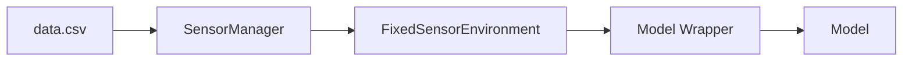

# Spatio-Temporal Data Analysis and Simulation Framework

## Overview
This project focuses on spatiotemporal machine learning using deep sets of random neighbors with attention mechanisms. The main objective is to simulate, analyze, and predict spatiotemporal phenomena based on sparse data collected through fixed or mobile sensors. This framework adheres to the conventions of **Farama Gymnasium**.

## Purpose and Context
As detailed in the accompanying article, the primary aim is to efficiently predict spatial and temporal variables while incorporating measures of uncertainty. The project demonstrates its utility across various datasets, including simulated data and real-world taxi flow data, by integrating deep learning with attention mechanisms.

## Data Flow

## Status

### Concluído
- Finalização do **SensorManager**, responsável pela interação direta com a base de dados, incluindo carregamento, pré-processamento e identificação de sensores.

- Desenvolvimento do **FixedSensorEnvironment**, que utiliza o SensorManager para simular interações no formato do Gymnasium Farama e Stable Baselines 3.

- Implementação do **Model Wrapper** (`deep_set_attention_net_wrapper.py`).

### Em Andamento
- Teste do LearningManager
  - Treinamento da rede
  - Comparação do resultado com o obtido pelo projeto anterior

### Próximos Passos

---

## System Components

### 1. Data Source
- **Input**: A CSV file containing sensor data with fields for latitude, longitude, timestamp, and observed values.
- **Sensor Identification**: Each sensor is uniquely identified by a combination of its latitude and longitude.

### 2. Data Flow
**SensorManager** is the core component that:
- **Loads Data**: Reads and preprocesses the CSV file.
- **Simulates Real-Time**: Manipulates the data to emulate real-time sensor readings.
- **Sensor Identification**: Assigns unique IDs to sensors based on spatial coordinates.
- **Data Access**: Enables the selection of specific sensors and their neighbors based on a time window.

### 3. Simulation Environment
**FixedSensorEnvironment** class:
- Adapts data processed by `SensorManager` into the **Farama Gymnasium** format.
- Provides interfaces for sensor interaction, time-step transitions, and data aggregation.

### 4. AI Model Wrapper
**deep_set_attention_net_wrapper.py**:
- Wraps neural network model and receives the environment as in a **Stable Baselines 3** pattern.
- Handles both training (`.train()`) and prediction (`.predict()`) phases.
- Integrates seamlessly with neural network models by receiving the environment as an argument.

### 5. Deep Learning Model
**deep_set_attention_net.py**:
- Encodes the architecture using deep sets with an attention mechanism for random neighbor selection.
- Provides uncertainty measures for predictions.

---

## Features

1. **Random Neighbor Selection**:
   - Randomly selects neighbors for prediction, ensuring a diverse range of spatial and temporal coverage.
2. **Uncertainty Estimation**:
   - Measures prediction confidence, enabling informed decision-making.

---

## Usage

### Examples
Located in the `examples/` directory, demonstrating:
- Data loading and preprocessing.
- Simulation setup for training and evaluation.
- Model training and inference workflows.

---

## Contact
For questions, suggestions, or contributions, please contact:

---
