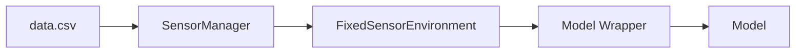

# Spatio-Temporal Data Analysis and Simulation Framework

## Installation

You will need **Python 3.12**.

Go to the root folder of the project (the folder that contains `pyproject.toml`), and run:

```bash
pip install .
```

To test the installation, go to the `wildfire_pyro/examples` folder and execute:

```bash
python fixed_sensor_environment_example.py
```

The `learning_example.py` file is still under development. However, you can run it to get an overview of the project's structure.

---

## Overview

This project focuses on **spatiotemporal machine learning** using **deep sets of random neighbors with attention mechanisms**. The primary goal is to **simulate, analyze, and predict** spatiotemporal phenomena based on sparse data collected through fixed or mobile sensors.

The framework follows **Farama Gymnasium** conventions for easy integration with reinforcement learning environments.

---

## Purpose and Context

As outlined in the accompanying article, this project aims to:
- Efficiently **predict spatial and temporal variables** while incorporating **uncertainty estimation**.
- Demonstrate **real-world applications** across multiple datasets, including **simulated and real-world taxi flow data**.
- Leverage **deep learning models with attention mechanisms** to improve prediction accuracy.

---

## Data Flow



### **Explanation**
- **data.csv** → The raw input dataset.
- **SensorManager** → Simulates real-time sensor data, processes input, and assigns sensor IDs.
- **FixedSensorEnvironment** → Converts sensor data into a Gym-like environment for ML models.
- **Model Wrapper** → Manages interactions between the model and environment.
- **Model** → The deep learning model that makes predictions.

---

## Project Status 🚧

**🔴 Current State:**  
The project is **under development** and currently **not functional** due to ongoing architecture changes. Major updates are being implemented.

### ✅ **Completed**
- Initial framework structure.
- Environment setup with **Gymnasium** compatibility.
- SensorManager module for handling sensor data.

### 🏗 **In Progress**
- **Callback Integration**
  - Implementing learning manager callbacks.
  - Adding core functions to `common/` and `utils/`.

### 🔜 **Next Steps**
- Finalize callback integration.
- Update documentation.

---

## System Components

### **1. Data Source**
- **Input:** A CSV file containing sensor data with fields for latitude, longitude, timestamp, and observed values.
- **Sensor Identification:** Each sensor is uniquely identified based on its latitude and longitude.

### **2. Data Flow**
The **SensorManager** module:
- **Loads & preprocesses data** from the CSV file.
- **Simulates real-time data streams** for training.
- **Assigns unique sensor IDs** based on coordinates.
- **Provides access to sensor readings** within a time window.

### **3. Simulation Environment**
The **FixedSensorEnvironment** class:
- Converts data processed by **SensorManager** into the **Farama Gymnasium** format.
- Provides **interfaces for sensor interaction** and **time-step transitions**.

### **4. AI Model Wrapper**
The **deep_set_attention_net_wrapper.py**:
- Acts as an interface between the model and environment.
- Uses a structure similar to **Stable Baselines 3 (SB3)**.
- Supports both **training (`train()`)** and **prediction (`predict()`)**.

### **5. Deep Learning Model**
The **deep_set_attention_net.py**:
- Implements **deep sets with an attention mechanism**.
- Supports **uncertainty estimation** for model predictions.

---

## Features

### ✅ **Random Neighbor Selection**
- Uses **random neighbors** to improve spatial and temporal coverage.

### ✅ **Uncertainty Estimation**
- Provides **confidence intervals** for model predictions.

---

## Usage

### 📂 **Examples**
You can find example scripts in the `examples/` directory, including:
- **Loading and preprocessing sensor data**.
- **Simulation setup for training and evaluation**.
- **Model training and inference workflows**.

To run an example:

```bash
cd wildfire_pyro/examples
python fixed_sensor_environment_example.py
```

---

## Contact

For questions, suggestions, or contributions, please contact:

📧 **Email:** 
📌 **GitHub Issues:**  
🌐 **Website/Docs:** 

---

## Acknowledgment

This project is **inspired by** and follows design patterns from **[Stable-Baselines3 (SB3)](https://github.com/DLR-RM/stable-baselines3)**. It incorporates **some modified SB3 code**, but remains a **separate implementation** with different objectives.

The original **SB3** code is licensed under the **MIT License**.

---

## Citation

If you use Stable-Baselines3 as inspiration, please cite their original paper:

```bibtex
@article{stable-baselines3,
  author  = {Antonin Raffin and Ashley Hill and Adam Gleave and Anssi Kanervisto and Maximilian Ernestus and Noah Dormann},
  title   = {Stable-Baselines3: Reliable Reinforcement Learning Implementations},
  journal = {Journal of Machine Learning Research},
  year    = {2021},
  volume  = {22},
  number  = {268},
  pages   = {1-8},
  url     = {http://jmlr.org/papers/v22/20-1364.html}
}
```