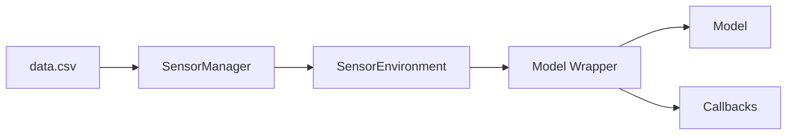

# 🧩 Architectural Decisions

### Agent-Environment Loop Style (Even for Supervised Learning)
We adopt the semantics of an interactive loop even in supervised settings to facilitate:
- Seamless incremental evaluation,
- Compatibility with reinforcement learning frameworks,
- Structured simulation pipelines for enhanced data handling.

### Domain-Coupled Baseline Method
Each environment uniquely implements its own `baseline()` method, which allows for:
- Fair and context-aware comparisons across models,
- Reproducibility and precise benchmarking under domain-specific conditions.

### Evaluation via Bootstrap Sampling
Bootstrap sampling is employed during model evaluation to:
- Estimate predictive uncertainty effectively,
- Implement ensemble-style inference approaches,
- Expose models to a diverse array of data scenarios, enhancing generalization.

### Structured and Modular Logging
- Integrated support for TensorBoard for advanced visualization and tracking,
- Robust fallback to `NoOpWriter` when logging is disabled,
- Data persistence in `.npz` format with future plans for `.csv` export,
- Organized logging by unique run identifiers to streamline model and configuration management.

---

## 🔐 Reproducibility by Design
- Rigorous control over all random processes via explicit RNG (Random Number Generator) settings,
- Ensures complete determinism in bootstrap sampling, sensor selection, and time indices with a consistent seed,
- Maintains reproducibility integrity, even during extensive system refactoring.

---

## 🔧 Flexible Optimizer Strategy
- Architecturally designed to accommodate various optimization backends (e.g., Optuna, Hyperopt, Grid Search) through dependency injection and the strategy pattern,
- Provides isolated run environments per optimizer to facilitate straightforward comparative analyses.

---

## 🧠 Code as Research Infrastructure
This codebase is strategically crafted with **clarity, modularity, and extensibility** at its core, serving as a bridge between modern software engineering practices and the operational demands of spatiotemporal AI research. The architecture is designed to balance:
- Traceable and reproducible experiments,
    - Randomness control with seeds. Future improvements will be with the use of random generator factory.
- Efficient prototyping capabilities,
- Sustainable support for long-term project evolution and maintenance.

---

## Data Flow

